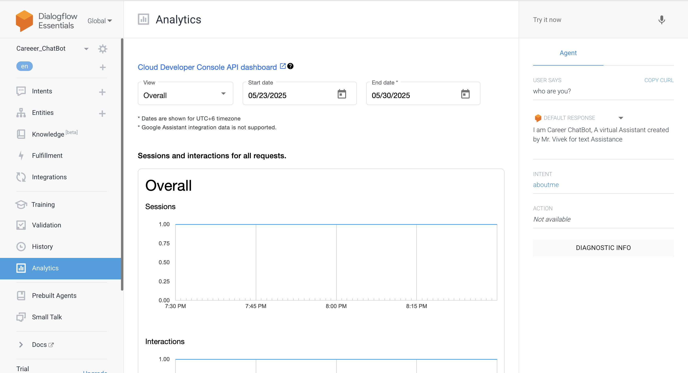

#  Dialogflow Careeer Chatbot

This project is a Google Dialogflow ES chatbot designed to assist students with queries related to course information, enrollment, and academic support.

## 🛠 Features
- Handles course-related queries with custom intents
- Multi-turn conversations using context
- Built using Dialogflow ES (No frontend/UI)

##  Files
- `Career_ChatBot.zip`: Exported Dialogflow agent
- `screenshots/`: Intent configuration and sample training phrases

##  How to Use
1. Go to [Dialogflow Console](https://dialogflow.cloud.google.com)
2. Create a new agent
3. Import `Career_ChatBot.zip`
4. Use the simulator to test

##  Screenshots
| Intents | Fullfillments | Analytics |
|--------|------------------|
|  |  |   |

---

##  Author
Mallavalli Sai Vivek  
[LinkedIn](https://linkedin.com/in/mallavallisaivivek)
